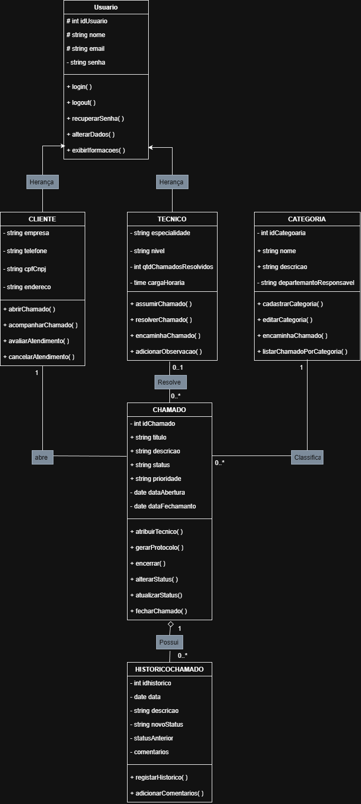

# 🎯 Sistema de Gerenciamento de Chamados - HelpDesk

## 👥 Integrantes do Grupo
- Kauã Wesley
- Arthur Vinicius 


## 🛠️ Tecnologias Utilizadas
- **.NET 10.0** - Framework principal
- **C# 10.0** - Linguagem de programação
- **Visual Studio / VS Code** - Ambiente de desenvolvimento
- **Git & GitHub** - Controle de versão e repositório

## 📊 Diagrama de Classes UML




## 🏗️ APLICAÇÃO DOS PRINCÍPIOS SOLID

### 1. ✅ **SRP - Single Responsibility Principle** (Princípio da Responsabilidade Única)

**Cada classe tem uma única responsabilidade bem definida:**

| Classe | Responsabilidade Única | Exemplo no Código |
|--------|----------------------|-------------------|
| `Usuario` | Gerenciar dados básicos de usuário | `// SRP: Responsabilidade única - gerenciar dados básicos de usuário` |
| `ChamadoService` | Executar regras de negócio de chamados | `// SRP: Responsabilidade única - gerenciar regras de negócio de chamados` |
| `ChamadoRepository` | Armazenar e recuperar dados de chamados | `// SRP: Responsabilidade única - armazenar e recuperar dados de chamados` |
| `Categoria` | Gerenciar categorias de chamados | `// SRP: Responsabilidade única - gerenciar categorias de chamados` |
| `HistoricoChamado` | Gerenciar histórico de alterações | `// SRP: Responsabilidade única - gerenciar histórico de alterações de chamados` |

**Trecho de código exemplificando SRP:**
```csharp
// SRP: ChamadoService tem única responsabilidade - gerenciar regras de chamados
public class ChamadoService
{
    private readonly IChamadoRepository _chamadoRepository;
    
    public void AbrirChamado(Chamado chamado) { ... }
    public List<Chamado> ListarPorStatus(string status) { ... }
    // Apenas métodos relacionados a operações com chamados
}


### 2. ✅ **OCP - Open/Closed Principle** (Princípio Aberto/Fechado)

**Classes estão abertas para extensão, mas fechadas para modificação:**

| Classe | Como atende OCP | Exemplo no Código |
|--------|----------------|-------------------|
| `Usuario` | É abstrata, permite criar `Cliente` e `Tecnico` sem modificar | `// OCP: Aberta para extensão (Cliente, Tecnico) mas fechada para modificação` |
| `Categoria` | Pode ser estendida para novos tipos de categoria | `// OCP: Aberta para extensão de novos tipos de categoria` |
| `HistoricoChamado` | Permite novos tipos de registro histórico | `// OCP: Aberta para extensão de novos tipos de registro histórico` |

**Trecho de código exemplificando OCP:**
```csharp
// OCP: Usuario é aberta para extensão (Cliente, Tecnico) mas fechada para modificação
public abstract class Usuario
{
    // Métodos comuns a todos os usuários
}

// Extensão sem modificar a classe base
public class Cliente : Usuario { ... }
public class Tecnico : Usuario { ... }


### 3. ✅ **LSP - Liskov Substitution Principle** (Princípio da Substituição de Liskov)

**Subclasses podem substituir a classe base sem quebrar o sistema:**

| Classe | Como atende LSP | Exemplo no Código |
|--------|----------------|-------------------|
| `Cliente` | Substitui `Usuario` em qualquer contexto | `// LSP: Pode substituir Usuario sem quebrar o sistema` |
| `Tecnico` | Substitui `Usuario` em qualquer contexto | `// LSP: Pode substituir Usuario sem quebrar o sistema` |
| `Chamado` | Implementa `IAtribuivel` e `IEncerravel` corretamente | `// LSP: Pode ser usado onde IAtribuivel ou IEncerravel são esperados` |

**Trecho de código exemplificando LSP:**
```csharp
// LSP: Cliente pode substituir Usuario em qualquer contexto
public void ProcessarUsuario(Usuario usuario)
{
    // Funciona tanto para Cliente quanto para Tecnico
    usuario.ExibirInformacoes();
    usuario.Login("email", "senha");
}

// Uso correto:
ProcessarUsuario(new Cliente(...));  // ✓
ProcessarUsuario(new Tecnico(...));  // ✓


### 4. ✅ **ISP - Interface Segregation Principle** (Princípio da Segregação de Interfaces)

**Interfaces são pequenas, específicas e focadas em um único comportamento:**

| Interface | Métodos | Como atende ISP | Exemplo no Código |
|-----------|---------|----------------|-------------------|
| `IAtribuivel` | 1 método | Interface mínima para atribuição de técnico | `// ISP: Interface pequena e específica - apenas um método` |
| `IEncerravel` | 1 método | Interface mínima para encerramento de chamado | `// ISP: Interface pequena e específica - apenas um método` |
| `IChamadoRepository` | 6 métodos | Focada apenas em operações de repositório de chamados | `// ISP: Interface pequena e específica para operações de repositório` |

**Trecho de código exemplificando ISP:**
```csharp
// ISP: Interface pequena e específica - apenas um método
// SRP: Responsabilidade única - definir contrato para atribuição de técnico
public interface IAtribuivel
{
    void AtribuirTecnico(Tecnico tecnico);  // Apenas 1 método específico
}

// ISP: Interface pequena e específica - apenas um método  
// SRP: Responsabilidade única - definir contrato para encerramento de chamado
public interface IEncerravel
{
    void Encerrar(string motivo);  // Apenas 1 método específico
}

// ISP: Interface focada apenas em operações de repositório
// DIP: Abstração para inversão de dependência
public interface IChamadoRepository
{
    void Adicionar(Chamado chamado);
    Chamado BuscarPorId(int id);
    List<Chamado> ListarTodos();
    List<Chamado> ListarPorStatus(string status);
    List<Chamado> ListarPorTecnico(Tecnico tecnico);
}


### 5. ✅ **DIP - Dependency Inversion Principle** (Princípio da Inversão de Dependência)

**Módulos de alto nível não dependem de módulos de baixo nível, ambos dependem de abstrações:**

| Componente | Implementação DIP | Exemplo no Código |
|------------|------------------|-------------------|
| `ChamadoService` | Depende de `IChamadoRepository` (interface) | `// DIP: Depende de abstração (IChamadoRepository), não de implementação concreta` |
| `IChamadoRepository` | Interface criada para abstração | `// DIP: Abstração para inversão de dependência` |
| `ChamadoRepository` | Implementação concreta da interface | `// DIP: Implementação concreta da interface IChamadoRepository` |
| `Program.cs` | Configura Dependency Injection | `// DIP: Injetando a dependência no serviço (Dependency Injection)` |

**Trecho de código exemplificando DIP - Abstração:**
```csharp
// DIP: Abstração criada para inversão de dependência
// ISP: Interface pequena e específica para operações de repositório
public interface IChamadoRepository
{
    void Adicionar(Chamado chamado);
    Chamado BuscarPorId(int id);
    List<Chamado> ListarTodos();
    List<Chamado> ListarPorStatus(string status);
    List<Chamado> ListarPorTecnico(Tecnico tecnico);
}